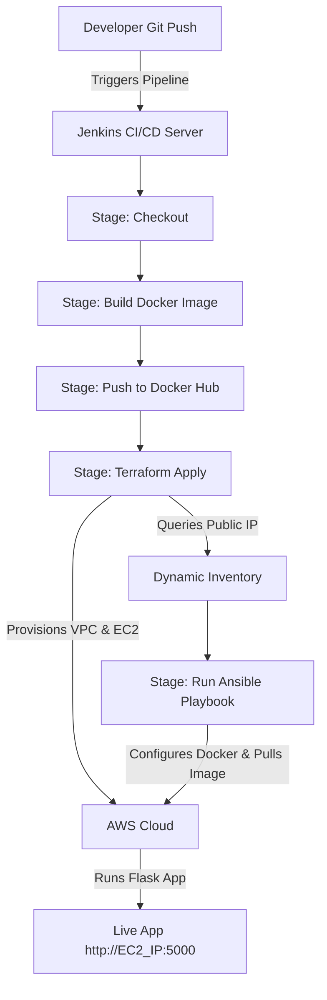

# Flask App Deployment Automation (DevOps Pipeline)

This project demonstrates an end-to-end DevOps automation pipeline for containerizing, provisioning, configuring, and deploying a simple Python Flask application onto AWS cloud infrastructure.

## Project Overview

The workflow begins with a basic Flask application. It is containerized via Docker and orchestrated through a Jenkins declarative pipeline. The pipeline automates the infrastructure provisioning using Terraform (IaC) and configuration management using Ansible. The final result is a dynamically deployed Flask application accessible to the public.

## CI/CD Pipeline Architecture Diagram

## Architecture Components

The AWS infrastructure is defined and created as code using Terraform:

- **VPC:** A dedicated Virtual Private Cloud with custom CIDR block `10.0.0.0/16`.
- **Subnet:** A public subnet (`10.0.1.0/24`) with automatic public IP assignment on instance launch.
- **Internet Gateway & Route Table:** Provides internet access to the public subnet.
- **Security Group:** Restricts and permits specific inbound traffic:
  - **Port 22:** Allowed for SSH management.
  - **Port 5000:** Exposed to allow incoming web traffic for the Flask application.
- **EC2 Instance:** A `t3.micro` instance running Amazon Linux 2023.

## Tools and Technologies

- **Application:** Flask (Python web framework)
- **Containerization:** Docker (package code, dependencies, and environments)
- **CI/CD Orchestration:** Jenkins (declarative pipeline automation)
- **Infrastructure as Code (IaC):** Terraform (declarative cloud resource provisioning)
- **Configuration Management:** Ansible (agentless configuration and application run)
- **Cloud Provider:** Amazon Web Services (AWS)

## CI/CD Pipeline Stages

The Jenkins declarative pipeline ([Jenkinsfile](file:///c:/Users/ksdja/Documents/GitHub/flask-app/Jenkinsfile)) executes the following steps:

1.  **Checkout:** Pulls the latest source code from the repository.
2.  **Build Docker Image:** Builds the Docker container from the [Dockerfile](file:///c:/Users/ksdja/Documents/GitHub/flask-app/Dockerfile).
3.  **Push to Docker Hub:** Authenticates with Docker Hub and pushes the tagged image.
4.  **Terraform Apply:** Initializes Terraform configuration and applies changes to provision AWS resources. It then dynamically queries the created EC2 public IP.
5.  **Run Ansible Playbook:** Authenticates SSH credentials using `sshagent`, generates a dynamic inventory configuration containing the new target host, and executes the Ansible playbook to prepare the host (Docker setup, container pulling, running the app).

## Key Highlights

- **Infrastructure as Code (IaC):** Version-controlled infrastructure definition ensures environments can be recreated reliably and consistently.
- **Dynamic Inventory Mapping:** Bridges the gap between infrastructure creation and server configuration. The Jenkins pipeline dynamically queries the newly assigned AWS EC2 public IP and configures the Ansible inventory on the fly.
- **Containerized Portability:** Docker isolates runtime dependencies so the Flask app behaves identically on local machines, build nodes, and production instances.
- **Agentless Configuration Management:** Ansible configures the target server securely over SSH without requiring any background agent installations on the EC2 host.

## Deployment Workflow

To run this pipeline, ensure you have set up the following prerequisites:

### Prerequisites & Setup

1.  **AWS Account Credentials:** Set up IAM credentials and store them securely in Jenkins (`aws-access-key-id` and `aws-secret-access-key`).
2.  **Docker Hub Credentials:** Create credentials in Jenkins named `dockerhub-creds` with your registry username and password.
3.  **SSH Key Pair:** Generate an SSH key pair (`flask-key.pem` and its public key). Upload the public key to AWS under the name `flask-key`, save the private key as a Jenkins credential `flask-ssh-key`, and place it locally in `~/.ssh/flask-key.pem` on the Jenkins agent.
4.  **Install Tools on Jenkins Agent:** Make sure Docker, Terraform, and Ansible are installed and configured on the Jenkins runner machine.

### Triggering the Pipeline

- Commit and push your changes to your Git repository.
- In Jenkins, create a new **Pipeline** project pointing to your repository branch.
- Click **Build Now** to execute the pipeline. Once completed, query the console output for the public IP or visit the public IP of your EC2 instance on port `5000`.

## Future Improvements

- Provision across multi availability zones

## License

This project is licensed under the [MIT License](file:///c:/Users/ksdja/Documents/GitHub/flask-app/LICENSE) - see the [LICENSE](file:///c:/Users/ksdja/Documents/GitHub/flask-app/LICENSE) file for details.
Copyright (c) 2026 Kalana Jayawardhana.
